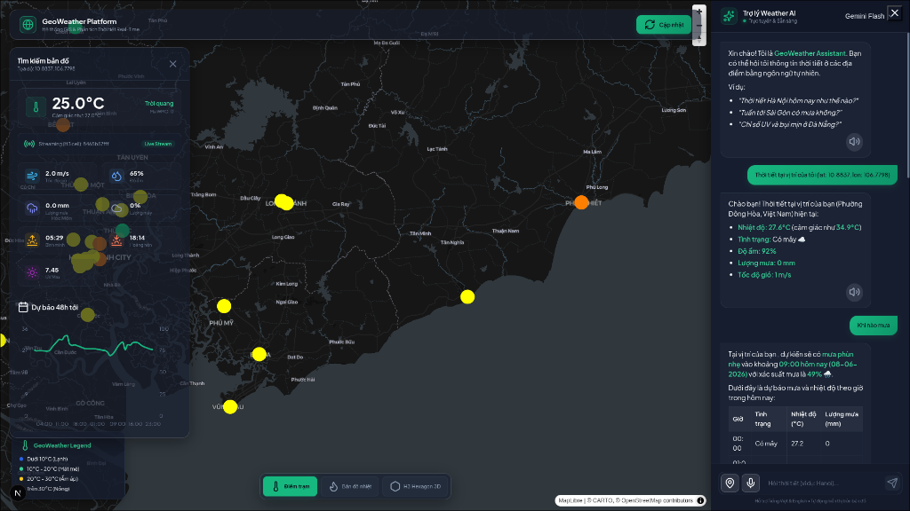

<!-- Improved compatibility of back to top link: See: https://github.com/othneildrew/Best-README-Template/pull/73 -->
<a id="readme-top"></a>

<!-- PROJECT SHIELDS -->
[![Contributors][contributors-shield]][contributors-url]
[![Forks][forks-shield]][forks-url]
[![Stargazers][stars-shield]][stars-url]
[![Issues][issues-shield]][issues-url]
[![MIT License][license-shield]][license-url]

<!-- PROJECT LOGO -->
<br />
<div align="center">
  <a href="https://github.com/auster-vn/geoWeather">
    <!--  -->
  </a>

  <h3 align="center">GeoWeather</h3>

  <p align="center">
    Hệ thống bản đồ thời tiết thời gian thực và trợ lý AI phân tích không gian.
    <br />
    <a href="https://github.com/auster-vn/geoWeather"><strong>Khám phá tài liệu »</strong></a>
    <br />
    <br />
    <a href="https://github.com/auster-vn/geoWeather/issues/new?labels=bug&template=bug-report---.md">Báo cáo Lỗi</a>
    ·
    <a href="https://github.com/auster-vn/geoWeather/issues/new?labels=enhancement&template=feature-request---.md">Yêu cầu Tính năng</a>
  </p>
</div>

<div align="center">
  
</div>

<!-- TABLE OF CONTENTS -->
<details>
  <summary>Mục Lục</summary>
  <ol>
    <li>
      <a href="#about-the-project">Giới thiệu Dự án</a>
      <ul>
        <li><a href="#built-with">Công nghệ sử dụng</a></li>
      </ul>
    </li>
    <li>
      <a href="#getting-started">Bắt đầu</a>
      <ul>
        <li><a href="#prerequisites">Yêu cầu hệ thống</a></li>
        <li><a href="#installation">Cài đặt</a></li>
      </ul>
    </li>
    <li><a href="#architecture">Kiến trúc</a></li>
    <li><a href="#usage">Sử dụng</a></li>
    <li><a href="#contributing">Đóng góp</a></li>
    <li><a href="#license">Giấy phép</a></li>
    <li><a href="#contact">Liên hệ</a></li>
  </ol>
</details>

<!-- ABOUT THE PROJECT -->
## About The Project

GeoWeather là một hệ thống bản đồ thời tiết thời gian thực được xây dựng với mục tiêu cung cấp dữ liệu thời tiết chính xác dựa trên lưới không gian lục giác H3 của Uber. Thay vì chỉ hiển thị thời tiết theo tên thành phố tĩnh, hệ thống thu thập và phân tích dữ liệu ở cấp độ không gian - thời gian, hỗ trợ truy vấn NLP thông minh thông qua trí tuệ nhân tạo.

### Công dụng (Use Cases)
* **Theo dõi thời tiết thời gian thực:** Cập nhật liên tục trạng thái thời tiết, nhiệt độ, lượng mưa, tốc độ gió trên bản đồ.
* **Phân tích không gian:** Phân mảnh bản đồ thành lưới H3 đa độ phân giải, giúp phân tích xu hướng thời tiết theo vùng chính xác.
* **Trợ lý AI siêu nhận thức vị trí (Context-aware AI):** Tự động trích xuất và ghi nhớ tọa độ GPS (lat/lon) xuyên suốt các lượt chat. Chỉ cần chia sẻ vị trí một lần, AI có thể liên tục dự báo mưa, tia UV và nhiệt độ chính xác đến từng mét vuông mà không cần hỏi lại tên tỉnh/thành phố.
* **Giao diện đa nền tảng mượt mà:** Tối ưu hóa trải nghiệm trên thiết bị di động (Mobile UI) với Bottom Sheet phong cách iOS, hiệu ứng Glassmorphism, và quản lý không gian bản đồ thông minh.
* **Giám sát hệ thống:** Thu thập các số liệu vận hành và hiệu suất hệ thống thời gian thực với Prometheus và Grafana.

<p align="right">(<a href="#readme-top">quay lại đầu trang</a>)</p>

### Built With

* [![Next][Next.js]][Next-url]
* [![React][React.js]][React-url]
* [![FastAPI][FastAPI]][FastAPI-url]
* [![Go][Go]][Go-url]
* [![PostgreSQL][PostgreSQL]][PostgreSQL-url]
* [![Redis][Redis]][Redis-url]
* [![Docker][Docker]][Docker-url]

<p align="right">(<a href="#readme-top">quay lại đầu trang</a>)</p>

<!-- GETTING STARTED -->
## Getting Started

Để có thể chạy dự án local, hãy làm theo các bước hướng dẫn bên dưới.

### Prerequisites

Hệ thống yêu cầu cài đặt Docker và Docker Compose.
* docker
  ```sh
  sudo apt-get install docker-ce docker-ce-cli containerd.io
  ```

### Installation

1. Lấy API Key từ [Google AI Studio](https://aistudio.google.com/) (Gemini) và [Mapbox](https://www.mapbox.com/).
2. Clone repository
   ```sh
   git clone https://github.com/auster-vn/geoWeather.git
   ```
3. Cài đặt các gói NPM ở thư mục Web (nếu muốn chạy UI riêng biệt)
   ```sh
   npm install
   ```
4. Đổi tên file `.env.example` thành `.env` (nếu có) hoặc tạo file `.env` ở thư mục gốc:
   ```env
   # API Keys
   GEMINI_API_KEY=ENTER_YOUR_API_KEY
   NEXT_PUBLIC_MAPBOX_TOKEN=ENTER_YOUR_API_KEY
   NEXT_PUBLIC_API_URL=http://localhost:8000
   
   # Database credentials
   POSTGRES_USER=geo_user
   POSTGRES_PASSWORD=your_password
   POSTGRES_DB=geo_weather
   ```
5. Khởi động toàn bộ cụm dịch vụ qua Docker Compose
   ```sh
   docker-compose up -d --build
   ```

<p align="right">(<a href="#readme-top">quay lại đầu trang</a>)</p>

<!-- ARCHITECTURE -->
## Kiến trúc

Hệ thống được thiết kế theo kiến trúc Microservices hướng sự kiện (Event-Driven):
1. **Data Ingestion Service:** Các background workers (producer) liên tục lấy dữ liệu từ Open-Meteo và đẩy vào TimescaleDB/PostGIS.
2. **Streaming Processor:** Lắng nghe thay đổi dữ liệu, tính toán các aggregate metric trên lưới H3 và phát sóng qua Redis Pub/Sub.
3. **API Layer:** FastAPI xử lý các truy vấn từ client, thực hiện Cache với Redis, Rate Limiting, và duy trì các kết nối WebSockets để đẩy dữ liệu thời gian thực cho UI.
4. **AI/NLP Layer:** Xử lý ngôn ngữ tự nhiên từ người dùng (Text/Audio), tích hợp Function Calling với Gemini 2.5 Flash để tra cứu CSDL.
5. **Gateway Layer:** Được viết bằng Go, đóng vai trò Reverse Proxy nhận traffic, xử lý phân luồng requests về các service thích hợp.

<p align="right">(<a href="#readme-top">quay lại đầu trang</a>)</p>

<!-- USAGE EXAMPLES -->
## Usage

Sau khi khởi động, các dịch vụ sẽ hoạt động tại:
* **Frontend Web UI:** `http://localhost:3001`
* **Backend API (Swagger Docs):** `http://localhost:8000/docs`
* **Grafana Dashboard:** `http://localhost:3002` (Mặc định: `admin`/`admin`)
* **Prometheus Metrics:** `http://localhost:9090`

<p align="right">(<a href="#readme-top">quay lại đầu trang</a>)</p>

<!-- CONTRIBUTING -->
## Contributing

Contributions are what make the open source community such an amazing place to learn, inspire, and create. Any contributions you make are **greatly appreciated**.

Nếu bạn có ý tưởng giúp dự án tốt hơn, hãy fork repo này và tạo một pull request. Bạn cũng có thể mở một issue với nhãn "enhancement". Đừng quên tặng dự án một ngôi sao (star)!

1. Fork the Project
2. Create your Feature Branch (`git checkout -b feature/AmazingFeature`)
3. Commit your Changes (`git commit -m 'Add some AmazingFeature'`)
4. Push to the Branch (`git push origin feature/AmazingFeature`)
5. Open a Pull Request

<p align="right">(<a href="#readme-top">quay lại đầu trang</a>)</p>

<!-- LICENSE -->
## License

Phân phối dưới giấy phép MIT. Xem file `LICENSE.txt` để biết thêm thông tin.

<p align="right">(<a href="#readme-top">quay lại đầu trang</a>)</p>

<!-- CONTACT -->
## Contact

Auster VN - [@auster_vn](https://auster-vn.github.io/#contact) 

Project Link: [https://github.com/auster-vn/geoWeather](https://github.com/auster-vn/geoWeather)

<p align="right">(<a href="#readme-top">quay lại đầu trang</a>)</p>

<!-- MARKDOWN LINKS & IMAGES -->
[contributors-shield]: https://img.shields.io/github/contributors/auster-vn/geoWeather.svg?style=for-the-badge
[contributors-url]: https://github.com/auster-vn/geoWeather/graphs/contributors
[forks-shield]: https://img.shields.io/github/forks/auster-vn/geoWeather.svg?style=for-the-badge
[forks-url]: https://github.com/auster-vn/geoWeather/network/members
[stars-shield]: https://img.shields.io/github/stars/auster-vn/geoWeather.svg?style=for-the-badge
[stars-url]: https://github.com/auster-vn/geoWeather/stargazers
[issues-shield]: https://img.shields.io/github/issues/auster-vn/geoWeather.svg?style=for-the-badge
[issues-url]: https://github.com/auster-vn/geoWeather/issues
[license-shield]: https://img.shields.io/github/license/auster-vn/geoWeather.svg?style=for-the-badge
[license-url]: https://github.com/auster-vn/geoWeather/blob/master/LICENSE.txt

[Next.js]: https://img.shields.io/badge/next.js-000000?style=for-the-badge&logo=nextdotjs&logoColor=white
[Next-url]: https://nextjs.org/
[React.js]: https://img.shields.io/badge/React-20232A?style=for-the-badge&logo=react&logoColor=61DAFB
[React-url]: https://reactjs.org/
[FastAPI]: https://img.shields.io/badge/FastAPI-009688?style=for-the-badge&logo=fastapi&logoColor=white
[FastAPI-url]: https://fastapi.tiangolo.com/
[Go]: https://img.shields.io/badge/Go-00ADD8?style=for-the-badge&logo=go&logoColor=white
[Go-url]: https://golang.org/
[PostgreSQL]: https://img.shields.io/badge/PostgreSQL-316192?style=for-the-badge&logo=postgresql&logoColor=white
[PostgreSQL-url]: https://www.postgresql.org/
[Redis]: https://img.shields.io/badge/Redis-DC382D?style=for-the-badge&logo=redis&logoColor=white
[Redis-url]: https://redis.io/
[Docker]: https://img.shields.io/badge/Docker-2496ED?style=for-the-badge&logo=docker&logoColor=white
[Docker-url]: https://www.docker.com/
