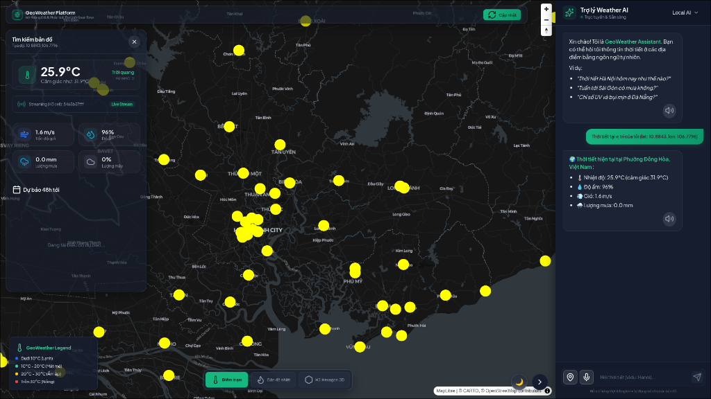
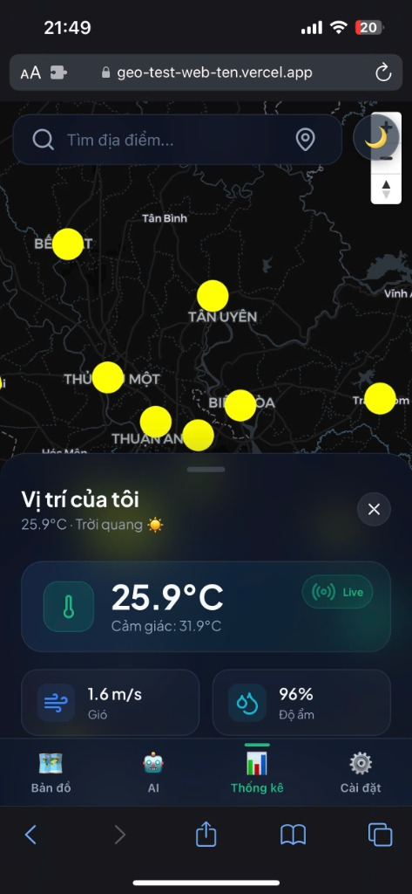

<div align="center">



<br/>
<br/>



<br/>
<br/>

<h1>🌏 GeoWeather</h1>

<p><strong>AI-powered real-time geospatial weather platform with hexagonal spatial indexing, NLP chat assistant, and live heatmap visualization</strong></p>

[](https://github.com/auster-vn/geoWeather/blob/main/LICENSE.txt)
[](https://nextjs.org/)
[](https://fastapi.tiangolo.com/)
[](https://golang.org/)
[](https://www.docker.com/)
[](https://www.postgresql.org/)
[](https://github.com/auster-vn/geoWeather/pulls)

<br/>

[**Demo**](#usage) · [**Quick Start**](#getting-started) · [**Architecture**](#architecture) · [**Report Bug**](https://github.com/auster-vn/geoWeather/issues) · [**Request Feature**](https://github.com/auster-vn/geoWeather/issues)

</div>

---

## ✨ What is GeoWeather?

Most weather apps show you a static number for a city. **GeoWeather does something different.**

It splits the entire Earth's surface into a **hexagonal H3 grid** (by Uber) and fills it with live meteorological data — then lets you talk to an **AI assistant** that understands *where* you are and *what* you're asking, without you having to repeat yourself.

> _"Chiều nay quận 1 có mưa không?"_ → The AI extracts your location from GPS or chat history, queries the nearest H3 cell, and tells you — in under 50ms — without calling any LLM API.

---

## 🚀 Key Features

| Feature | Description |
|---|---|
| 🗺️ **Live Heatmap** | WebGL-accelerated weather heatmap rendered with MapLibre GL at 60 FPS |
| 🔷 **Uber H3 Grid** | Multi-resolution hexagonal spatial indexing (res 4 → res 7) for zoom-adaptive data |
| 🤖 **Context-Aware AI** | Chat assistant that remembers your GPS position across turns — share location once, never again |
| ⚡ **Local NLP** | FlashText O(1) city extraction — 50ms vs 3-5s for LLM round-trip |
| 📍 **Reverse Geocoding** | Click anywhere on the map → auto-extracts street/ward/district via OpenStreetMap Nominatim |
| 📱 **Mobile-First UI** | iOS-style Bottom Sheet, Glassmorphism panels, gesture-driven layout |
| 📊 **Observability** | Prometheus metrics + Grafana dashboards out of the box |
| 🔄 **Real-time Sync** | WebSocket push from TimescaleDB → Redis Pub/Sub → Frontend |

---

## 🏗️ Architecture

```
┌─────────────────────────────────────────────────────────────────┐
│                        CLIENT LAYER                             │
│   Next.js 15 + MapLibre GL + Framer Motion (port 3001)          │
└────────────────────────────┬────────────────────────────────────┘
                             │ HTTP / WebSocket
                             ▼
┌─────────────────────────────────────────────────────────────────┐
│                      GATEWAY LAYER (Go)                         │
│   Reverse Proxy · Rate Limiting · Request Routing (port 80)     │
└──────────┬──────────────────────────────────────┬───────────────┘
           │                                      │
           ▼                                      ▼
┌──────────────────────┐              ┌────────────────────────────┐
│   API LAYER          │              │   STREAMING PROCESSOR      │
│   FastAPI (Python)   │◄─────────────│   Redis Pub/Sub listener   │
│   • REST + WebSocket │              │   H3 aggregate compute     │
│   • NLP / AI Chat    │              └────────────┬───────────────┘
│   • Cache (Redis)    │                           │
└──────────┬───────────┘                           │
           │                                       │
           ▼                                       ▼
┌──────────────────────────────────────────────────────────────────┐
│                    DATA LAYER                                     │
│  PostgreSQL + PostGIS + TimescaleDB (hypertable time-series)      │
│  ┌──────────────────┐   ┌───────────────┐   ┌────────────────┐   │
│  │ weather_current  │   │weather_obs    │   │ cities / geo   │   │
│  │ (H3 aggregates)  │   │(hourly series)│   │ (10k+ cities)  │   │
│  └──────────────────┘   └───────────────┘   └────────────────┘   │
└──────────────────────────────────────────────────────────────────┘
           ▲
           │
┌──────────┴───────────┐
│  DATA INGESTION       │
│  Open-Meteo → Parser │
│  → H3 index → UPSERT │
│  (batch 100 coords)  │
└──────────────────────┘
```

### NLP Chat Flow (≤50ms for simple queries)

```
User message
    │
    ├─ GPS pattern detected? (lat:..., lon:...) ──► Nominatim Reverse Geocode
    │
    ├─ Intent extraction (rain / sun / forecast / weekly)
    │
    ├─ FlashText city scan (O(1), 10k+ keywords, Trie-based)
    │
    ├─ Hit? ──► Query TimescaleDB directly ──► Markdown + [MAP:lat,lon]
    │
    └─ Miss? ──► Gemini 2.5 Flash (function calling) ──► Structured response
```

---

## 🛠️ Tech Stack

### Frontend
| | Technology | Purpose |
|---|---|---|
| ⚛️ | **Next.js 15** (App Router, TypeScript) | SSR, routing, performance |
| 🗺️ | **MapLibre GL JS** | WebGL vector map rendering |
| 🎨 | **Tailwind CSS + Framer Motion** | Styling & animations |
| 📦 | **Zustand** | Lightweight global state |

### Backend
| | Technology | Purpose |
|---|---|---|
| 🐍 | **FastAPI** (ASGI / async) | REST API + WebSocket |
| 🔵 | **Go** | High-performance gateway / reverse proxy |
| 🦀 | **Rust** (`packages/core-rs`) | Performance-critical core utilities |
| 🤖 | **Gemini 2.5 Flash** | LLM fallback for complex queries |
| 🔍 | **FlashText** | O(1) local city/entity extraction |

### Data
| | Technology | Purpose |
|---|---|---|
| 🐘 | **PostgreSQL + PostGIS** | Spatial queries (`ST_DWithin`, `ST_MakePoint`) |
| 📈 | **TimescaleDB** | Hypertable time-series partitioning |
| ⚡ | **Redis** | Cache + Pub/Sub streaming |
| 🔷 | **Uber H3** | Hexagonal spatial grid indexing |
| 🌐 | **Open-Meteo API** | Free weather data (no API key limit) |

### Infrastructure
| | Technology | Purpose |
|---|---|---|
| 🐳 | **Docker Compose** | Full local cluster orchestration |
| 📊 | **Prometheus + Grafana** | Metrics & observability |
| 🔒 | **Supabase** | Managed PostgreSQL (free tier) |

---

## 🚦 Getting Started

### Prerequisites

- [Docker](https://docs.docker.com/get-docker/) & Docker Compose v2
- [Node.js](https://nodejs.org/) 20+ (for local frontend dev only)
- API keys: **[Gemini](https://aistudio.google.com/)** + **[Mapbox](https://www.mapbox.com/)**

### Installation

**1. Clone the repo**
```bash
git clone https://github.com/auster-vn/geoWeather.git
cd geoWeather
```

**2. Configure environment**
```bash
cp .env.example .env
# Fill in your API keys:
```

```env
# AI & Map
GEMINI_API_KEY=your_gemini_key
NEXT_PUBLIC_MAPBOX_TOKEN=your_mapbox_token

# API endpoints
NEXT_PUBLIC_API_URL=http://localhost:8000
NEXT_PUBLIC_WS_URL=ws://localhost:8000

# Database
POSTGRES_USER=geo_user
POSTGRES_PASSWORD=your_secure_password
POSTGRES_DB=geo_weather
DATABASE_URL=postgresql+asyncpg://geo_user:your_secure_password@db:5432/geo_weather

# Redis
REDIS_URL=redis://redis:6379
```

**3. Start the full stack**
```bash
docker-compose up -d --build
```

**4. (Optional) Local frontend dev**
```bash
cd apps/web
npm install
npm run dev
```

### Service Endpoints

| Service | URL | Credentials |
|---|---|---|
| 🌐 **Frontend** | http://localhost:3001 | — |
| 📖 **API Docs (Swagger)** | http://localhost:8000/docs | — |
| 📊 **Grafana** | http://localhost:3002 | `admin` / `admin` |
| 📈 **Prometheus** | http://localhost:9090 | — |

---

## 📁 Project Structure

```
geoWeather/
├── apps/
│   ├── web/                # Next.js 15 frontend
│   │   ├── app/            # App router pages
│   │   ├── components/     # UI components (map/, mobile/, panels/)
│   │   ├── hooks/          # Custom React hooks
│   │   └── store/          # Zustand state management
│   ├── api/                # FastAPI backend
│   │   ├── core/           # DB, config, dependencies
│   │   ├── routers/        # API route handlers
│   │   ├── services/       # NLP, AI, weather logic
│   │   └── tools/          # LLM function-calling tools
│   └── gateway/            # Go reverse proxy
├── services/
│   ├── ingestion/          # Open-Meteo data pipeline
│   └── streaming/          # Redis Pub/Sub processor
├── packages/
│   └── core-rs/            # Rust core utilities
├── infra/                  # Terraform / deployment configs
├── free_deployment/        # Scripts for Supabase free-tier
├── docker-compose.yml
└── .env.example
```

---

## 🎯 Use Cases

- **🌧️ Hyperlocal rain alerts** — Query weather at exact GPS coordinates, not just city level
- **🗺️ Spatial weather analysis** — Compare temperature/rain across H3 grid zones on the map
- **🤖 Conversational forecasts** — Ask in natural Vietnamese/English, get structured answers
- **📡 IoT data ingestion** *(roadmap)* — Accept data from ESP32 weather stations

---

## 🔮 Roadmap

- [ ] **Flood Warning System** — ML model on TimescaleDB rain series + DEM elevation data
- [ ] **IoT Weather Stations** — Open API for ESP32/sensor direct push
- [ ] **Traffic + Weather Routing** — "Rain-free" route suggestions for delivery riders
- [ ] **PWA Offline Mode** — Cache last H3 snapshot for offline use
- [ ] **Multi-language NLP** — Expand beyond Vietnamese/English

---

## 🤝 Contributing

Contributions are welcome! GeoWeather is an open platform for geospatial weather innovation.

1. Fork the Project
2. Create your Feature Branch (`git checkout -b feature/AmazingFeature`)
3. Commit your Changes (`git commit -m 'feat: add AmazingFeature'`)
4. Push to the Branch (`git push origin feature/AmazingFeature`)
5. Open a Pull Request

Please follow [Conventional Commits](https://www.conventionalcommits.org/) for commit messages.

---

## 📄 License

Distributed under the **MIT License**. See [`LICENSE.txt`](LICENSE.txt) for more information.

---

## 👤 Contact

**Auster VN** — [@auster_vn](https://auster-vn.github.io/#contact)

🔗 **Project:** https://github.com/auster-vn/geoWeather

---

<div align="center">
  <sub>Built with ❤️ using Next.js · FastAPI · Go · PostgreSQL · Uber H3 · Gemini AI</sub>
</div>
